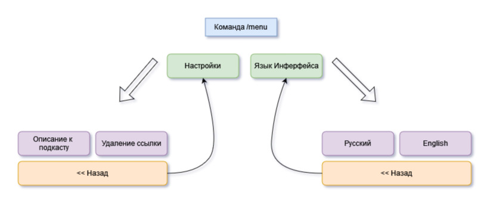

# Audio Cast Bot

[Описание проекта](#описание-проекта)   
[Технологии](#технологии)   
[Установка проекта](#Установка-проекта)


Это бот для создания подкастов. Он скачивает аудио-дорожку из видео на Youtube и присылает пользователю. Программа создавалась в первую очередь для собственного использования с целью заменить прослушивание музыки на более полезные источники информации.


## Описание проекта

Команды бота:
- /start - приветствие пользователя
- /help - справка по использованию
- /menu - клавиатура с действиями для пользователя
- /cancel - отменить текущее состояние
- _____ - отправка обычным сообщением ссылки на видео из Youtube



## Технологии

Для интернационализации бота была использована технология [Fluent](https://projectfluent.org/).    
Для ее использования была создана библиотка [fluentogram](https://github.com/Arustinal/fluentogram).

Поскольку постоянно использовать API для перевода текстов затратная по времени работы процедура, то намного выгоднее хранить тексты сообщений в виде текстовых файлов. Fluent как раз про это. Нужно лишь нужную структуру файлов и добавить их на обраоботку библиотеке.

Мною на практике была использована следующая структура файлов:
```
|- locales
    └─ en
        base_cmd_en.ftl
        buttons_en.ftl
        menu_en.ftl
        
    └─ ru
        base_cmd_ru.ftl
        buttons_ru.ftl
        menu_ru.ftl
```

## Установка проекта

Чтобы установить проект, нужно выполнить следующие команды в терминале.

Для начала создадим папку проекта и переместимся в нее:
```
mkdir app
cd app
```

Инициализируем в ней git репозиторий:
```
git init
```

Склонируем содержимое проекта:
```
git pull https://github.com/ecol-master/AudioCast-Bot master
```
Создадим виртуальное окружение:
```
python -m venv venv
```
Дальше необходимо его активировать.     
Если у вас Windows используйте следующую команду:
```
venv\Scripts\activate
```

А на Linux и MacOS эту:
```
venv/bin/activate
```

Теперь установим необходимые для запуска проекта зависимости. Сделать это можно данной командой:
```
pip install -r requirements.txt
```

Дальше переходим в папка проекта ```./audio_cast/``` командой:
```
cd audio_cast
```
Перед запуском необходимо внутри папки ```audio_cast``` создать файл ```.env```. В него нужно записать значения API-ключа для вашего бота и ADMIN_ID - ваше id пользователя в Telegram.
Также внутри этой же папки (```audio_cast```) создайте две пустые папки ```data``` и ```db```.

Запускаем бота командой
```
python __main__.py
```
